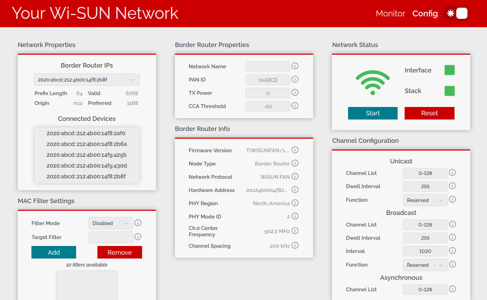

# Description

This application allows the user to configure, visualize, and monitor their WiSUN Network.

# Prerequisites

- Install **wfantund**

- Install **Node.js** v16.13.2 (Newer versions may work but are not guaranteed)

  First install npm

  ```bash
  sudo apt install npm
  ```

  Install n globally (-g) to install specific versions of Node.js

  ```bash
  sudo npm install -g n
  ```

  Install Node.js version 16.13.2

  ```bash
  sudo n 16.13.2
  ```

  Verify Node.js version for superuser

  ```bash
  sudo node --version
  v16.13.2
  ```

- Install client dependences and build the frontend (html, js, css):
  ```bash
  cd <project-root>/client
  npm install
  npm run build
  ```
- Install server dependences:

  ```bash
  cd <project-root>/server
  npm install
  ```

# Running

First connect the border router to the host linux machine. Start the webserver by running the following commands:

(By default this app uses /dev/ttyACM0 for the serial port)

```bash
cd <project-root>/server
npm run wfan
```

When developing, it can be necessary to restart the server frequently while making changes. Since this app manages wfantund, it can cause wfantund errors if left in the default mode. To fix this, add the `-d` or `--dev-mode` option. This prevents the app from managing wfantund, so you will need to run wfantund separately in another terminal (e.g. `sudo wfantund -s /dev/ttyACM0`).

Another option provided for this server is to use a different serial port from the default /dev/ttyACM0. To do this, add the `-s` or `--serial-port` option followed by the serial port (e.g. `/dev/ttyS0`). Other options are specified in `<base wfantund directory>/ti-wisun-webapp/server/src/AppConstants.js`.

To add an option when running the server, first add a "--" and then specify your options (npm script syntax).

Example running the server using serial port /dev/ttyS0 in dev mode:
```bash
npm run wfan -- -s /dev/ttyS0 -d
```

View the app in a browser by navigating to http://localhost:80

The network configuration tab will appear. This allows you to configure
the values of ncp properties. The explanation behind these properties can be
found
[here](https://dev.ti.com/tirex/explore/content/simplelink_cc13x2_26x2_sdk_5_20_00_52/docs/ti_wisunfan/html/wisun-guide/NWP_interface.html#:~:text=TI%20Wi%2DSUN%20FAN%20NWP%20Properties).



After the border router has started its network, the network nodes should be
given a few minutes to connect. Once the nodes connect, they will appear in the
monitor tab. This tab allows this network to be monitored for latency, success rate, and topology.


Now you have an easy-to-use GUI for interacting with your WiSUN Network!

# Frontend Development

Before making changes to the React-based frontend, execute the following commands to start a file watcher that will quickly build your changes to the `/build` directory within the `<project-root>/client` directory. (Reload the browser each time you make changes and they will be reflected due to the watcher)

```bash
cd <project-root>/client
npm run watch
```

# Tips

Logs generated by **wfantund** and the webserver are dumped in the `/tmp/ti-wisun-webapp/logs` directory.

# Troubleshooting

In development, you may run out of file watchers available on the system. This [solution](https://stackoverflow.com/questions/22475849/node-js-what-is-enospc-error-and-how-to-solve) has fixed this issue in the past.

# Notes

The `ti-wisun-webapp/.vscode` directory has settings that can be helpful for developing with vscode
